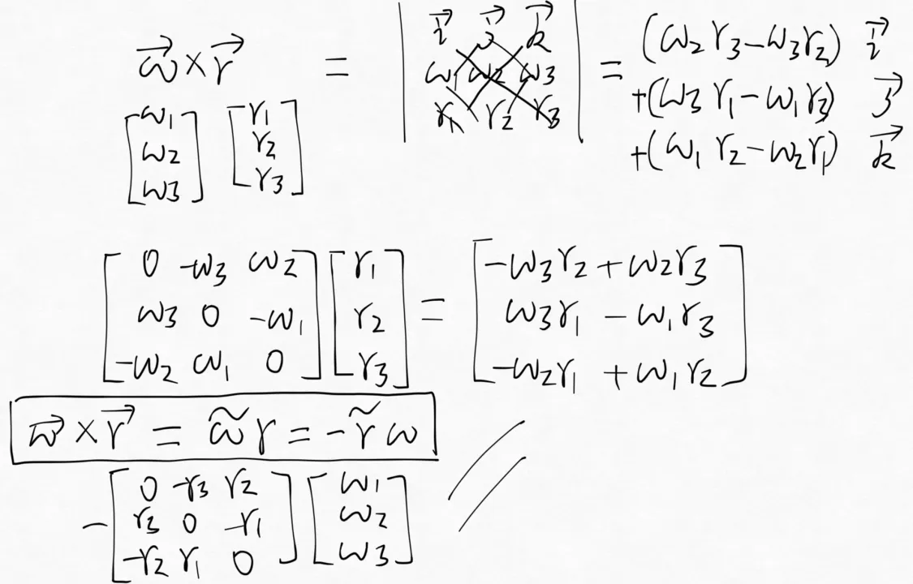
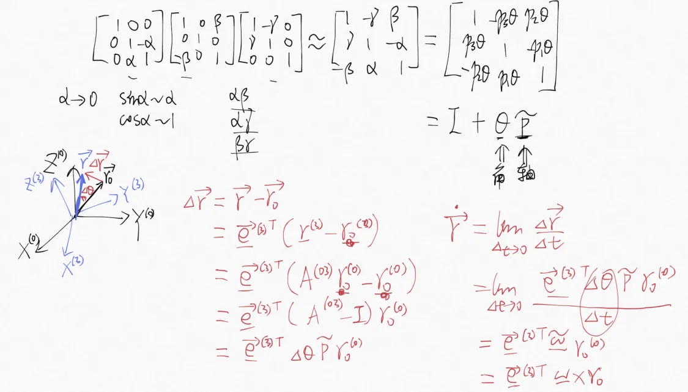
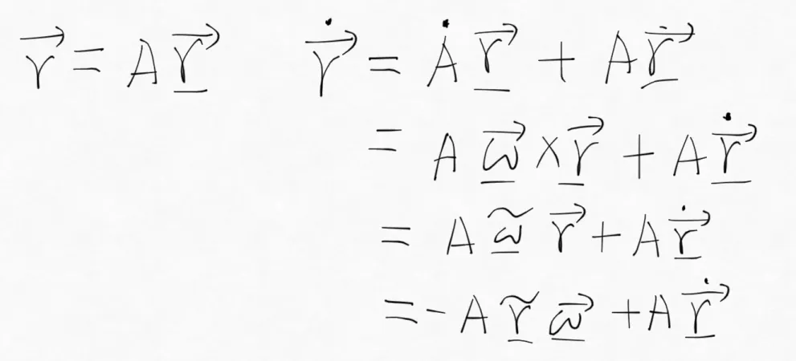
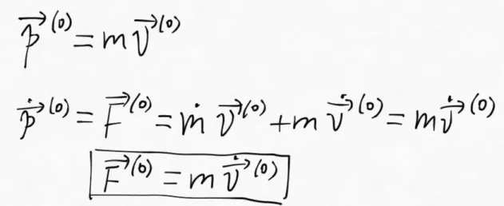
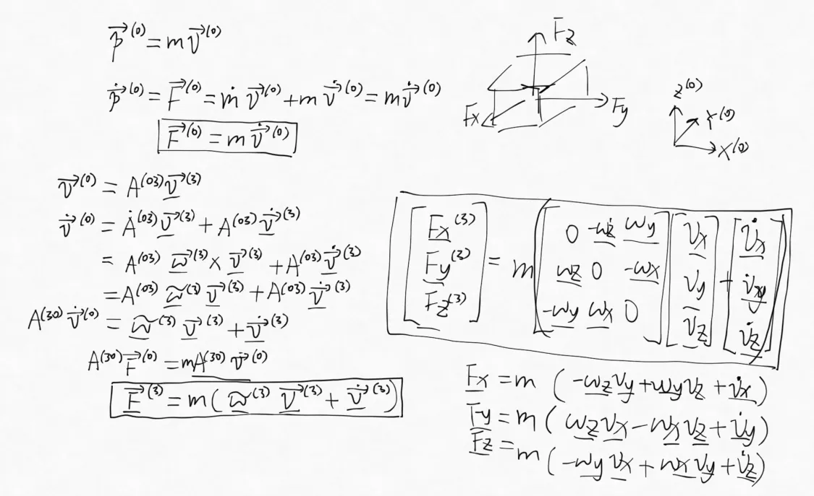
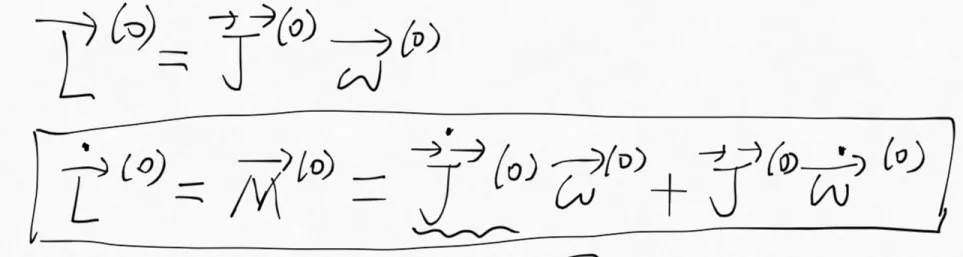
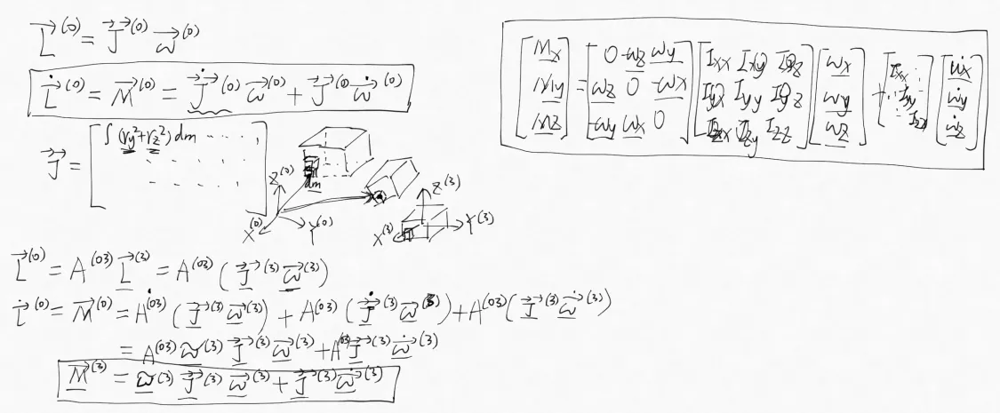

# 三、单刚体无约束动力学模型

## 3.1 两个重要结论

### 3.1.1 叉乘的矩阵表示

反对称矩阵

### 3.1.2 旋转矩阵的求导

空间矢量的求导

## 3.2 动量定理导出平移运动的动力学模型

### 3.2.1 惯性系下平移动力学模型

### 3.2.2 刚体系下平移动力学模型

## 3.3 角动量定理导出旋转运动的动力学模型

### 3.3.1 惯性系下旋转动力学模型

### 3.3.2 刚体系下旋转动力学模型

